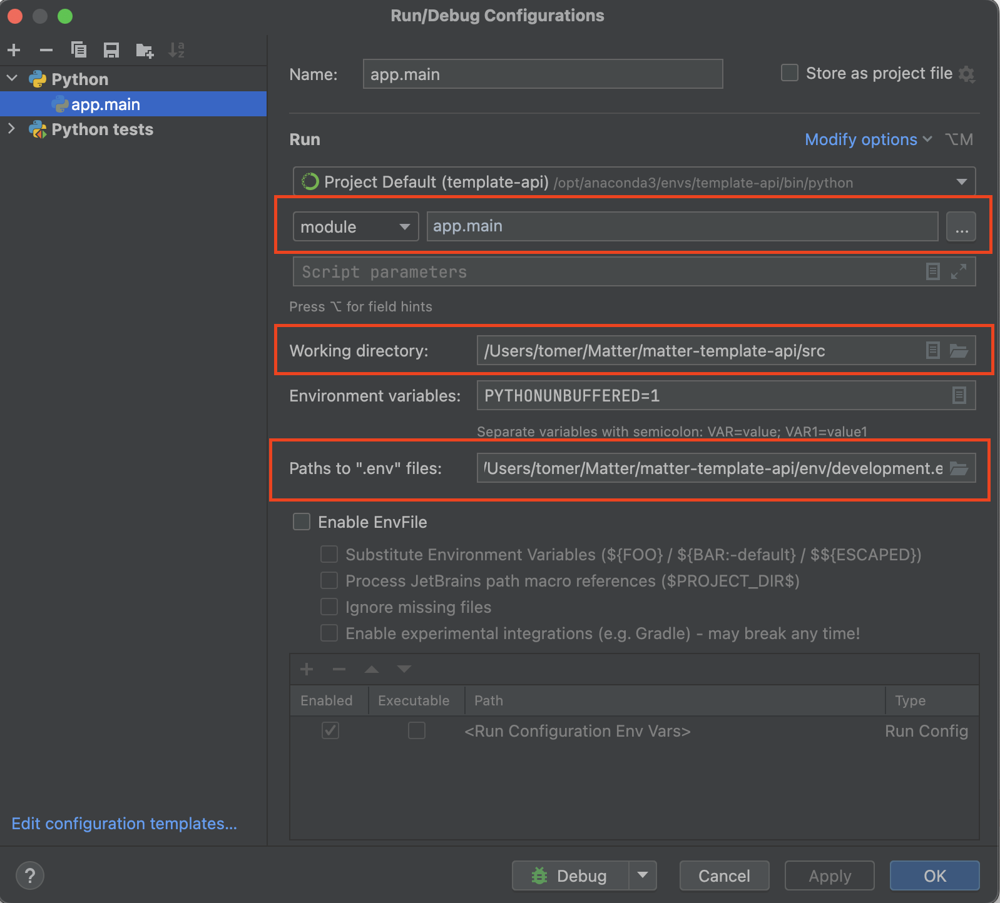

# Metric Metadata Service 
Welcome to the Metric Metadata Service!

The Metric-Metadata-Service is a specialized service designed to manage metrics data efficiently. 
It provides functionality to handle information about metrics in a manner consistent with the updated version of the Source of Truth (SoT) document. 
Additionally, the service supports defining configurable properties for various entity types and implements robust logging of system events to ensure traceability and accountability.

This FastAPI-based service is part of Matter's innovative mirco-service based platform.
Matter is a leading ESG (Environmental, Social, and Governance) analysis fintech company that provides innovative solutions to help investors and companies make informed decisions based on ESG factors. Our mission is to drive sustainable and responsible investment by leveraging cutting-edge technology and data-driven insights.

At Matter, we offer a comprehensive suite of tools and services, including:

- ESG data and ratings
- Portfolio analysis and optimization
- Company screening and benchmarking
- Customized reporting and analytics

Our team of experts combines deep domain knowledge in ESG with advanced data science and machine learning techniques to deliver actionable intelligence to our clients.

For more information about Matter, visit our website at [https://www.thisismatter.com/](https://www.thisismatter.com/).

---

# Introduction
Utilizes PostgreSQL as the primary database for storing structured data.
Leverages Redis for efficient caching to improve performance.
Built with the matter-persistence library for seamless database interaction.
Exposes HTTP endpoints to enable interaction with client applications.

Currently, the Metric-Metadata-Service operates independently and is not connected to any other services within Matter's ecosystem.

# Entities

1. **MetricSets** (Core) - Used as categories for the rest of the core entities.
2. **MetricSetTrees** (Core) - Used as a three for the page structure in the Matter's platform.
3. **Metrics** (Core) - Describe the actual metrics showed within the platform.
4. **DataMetrics** (Core) - Bridge between the metrics in the platform and the data metrics stored in the backend.
5. **Properties** (Util) - Util entity used for defining properties of the core entities.
6. **Events** (Util) - Util entity used for creating event logs.


# Features
* CRUD operations of all core entities.
* Defining and managing properties of the core entities.
* Validation of data stored for the core entities (Can't add additional metadata that is not predefined as property).
* Creation of event logs.
* Filtering, pagination, sorting of all entities.


# Getting started
Follow the instructions below to get started with the Metric Metadata Service.

## Installation

**Prerequisite:** Make sure that conda is installed.

Clone the repository:
```console
git clone git@github.com:Matter-Tech/metric-metadata-service.git
cd metric-metadata-service
```

**Linux**: Install Debian's ```libpq-dev``` package:
```console
sudo apt install libpq-dev
```

Setup a new conda environment (and specify the required Python version):
```console
conda create --name metric-metadata-service python=3.12
```

Activate the newly created environment:
```console
conda activate metric-metadata-service
```

Install Poetry:
```console
pip install poetry
```

Install the project's packages (including test libraries) with poetry:
```console
poetry install --with development
```

Set up `pre-commit` hooks specified in `.pre-commit-config.yaml` - right now formatting & linting with `ruff`:
```console
pip install pre-commit
pre-commit install
```


## Running

### Locally (with bash)

To start the application locally:

First, if you use WSL, find the WSL IP Address. This address can be later used to connect Postman to the API, and/or connect to other services e.g. database.
```console
# from WSL:

ip addr show eth0

# Look for the inet address, and it will typically be in the format 172.x.x.x or 192.x.x.x.
# Example:
# 2: eth0: <BROADCAST,MULTICAST,UP,LOWER_UP> mtu 1500 qdisc mq state UP group default qlen 1000
#    link/ether 00:15:5d:82:95:8d brd ff:ff:ff:ff:ff:ff
#    inet 172.25.90.23/20 brd 172.25.95.255 scope global eth0
#       valid_lft forever preferred_lft forever
#    inet6 fe80::215:5dff:fe82:958d/64 scope link
#       valid_lft forever preferred_lft forever
#
# In this case, the IP is 172.25.90.23
```

Load the environment variables in the following way:
```console
source ./scripts/load_env_var.sh
```

Run a docker-compose local environment, to enable the API to access essential services:

```console
./scripts/run_local_env.sh
```

Open another shell window.
Then launch the FastAPI App: 
```
cd src
python app/main.py
```

### Locally (with PyCharm)

Run a docker-compose local environment, enabling the API to access essential services:

```console
./scripts/run_local_env.sh
```

Open Pycharm. Then configure the project's interpreter to the conda environment you created in the first step.
When done, make sure to set the following in the Debug Configuration: 
1. Set the working path to the src folder.
2. Change from Script to Module and set to app.main
2. Point the env file to env/development.env



### Containerized

A `docker-compose` is also provided, containing all the application dependencies, and can also be used for local development:
```
docker-compose up --build
```
Note: this setup could be used for end-to-end tests.
It may take up to 20 seconds for the service to be fully loaded.

## Testing

### Locally (with PyCharm)
First, run the test environment:
```console
./scripts/run_test_env.sh
```

Then run the tests with ```pytest```, or directly from **PyCharm**. 

### Containerized
The script below will run all the available tests in the following order:
1. Unit
2. Integration
3. End-to-End
```
./scripts/run_tests.sh
```
This script also creates and removes the test environment automatically.

## Database Migrations

To create a new database migration, create your BaseDBModel like this:

```python
class OrganizationModel(CustomBase):
    __tablename__ = "organizations"

    id = Column(
        UUID(as_uuid=True),
        primary_key=True,
        default=uuid.uuid4,
        nullable=False,
    )

    organization_name = Column(String(100), unique=True, index=True, nullable=False)
    organization_email = Column(String(100), unique=True, index=True, nullable=False)

    first_name = Column(String(100), nullable=True)
    last_name = Column(String(100), nullable=True)
```

Then run the following command to generate a new migration file:

```console
alembic revision --autogenerate --message "Create organization table"
```

This will create a new migration in the `alembic/versions` folder.

See docs here at: https://alembic.sqlalchemy.org/en/latest/tutorial.html#create-a-migration-script

Then run the following to apply all the new migrations:

```console
alembic upgrade head
```

You can now run the following command to check the current state of the database:

```console
alembic heads --verbose
```

if you have multiple heads, run the command below to merge them. This will result in an empty migration that has multiple `down_versions`:

```console
alembic merge heads
```

Multiple heads are not supported by the deployment pipelines.

# Deployment

This Metric Metadata Service repository comes with a built-in GitHub Actions CI/CD pipeline that automates the testing and deployment process. The pipeline is triggered whenever changes are pushed to the repository, ensuring that the code remains reliable and functional.

The CI/CD pipeline includes the following steps:

* **Testing:** The pipeline automatically runs the test suite associated with the API, executing unit tests, the integration, and the end-2-end tests to verify the correctness of the code. If any tests fail, the pipeline will halt, and the deployment will not proceed until the issues are resolved.
* **Containerization:** After successfully passing the tests, the pipeline builds a Docker image of the API using the provided Dockerfile. This image encapsulates the application code, dependencies, and runtime environment, making it easy to deploy and run consistently across different environments.
* **Deployment:** Once the Docker image is built, the pipeline can deploy the API to a target environment, such as a Kubernetes cluster. The repository includes Kubernetes YAML files located in the kubernetes folder, which define the necessary resources and configurations for deploying the API on a Kubernetes cluster.


# Business Logic

* **Purpose:** The main purpose of this service is to store the metrics data and metadata used by the frontend platform.
* **Business Rules:** When pushing core entities' metadata validation for existence of such properties will be applied.
* **Integration Points:** No endpoints with a though for integration.
* **Error Handling:** Global error handlers are handling logging of all error occurrences. Specific error handlers are utilized throughout the service.
* **Logging and Monitoring:** The service doesn't have distributed logging and monitoring, however it has the setup from template-api. It does log every service call and every SQL query though.
* **Assumptions and Limitations:** The service has limitation on how many events it can handle so it's not fit for prolonged use without further updates.

# Project structure

The Metric Metadata Service project is organized into multiple layers, each responsible for specific functionality. This well-structured architecture promotes code separation, maintainability, and scalability. The project follows the three-layer architecture (router, service, and DAL) for handling API endpoints and business logic.

## Layers Description
### Router (Endpoints)
The api package contains the API routers that define the endpoints. Each router corresponds to a specific functionality, and the endpoints are defined using FastAPI's decorators. These routers handle incoming HTTP requests, validate the input data, and pass it to the appropriate service layer.

### Service (Business Logic)
The service package contains the business logic of the Metric Metadata Service. It contains modules responsible for processing incoming requests, performing ESG portfolio analysis, and returning analysis results. The service layer interacts with the Data Access Layer (DAL) to fetch data from the database or other external sources, as needed.

### DAL (Data Access Layer)
The dal package encapsulates the interaction with the database or any external data sources. It provides functions to perform CRUD operations and fetch data required for the analysis service. The DAL abstracts away the underlying data storage, making it easier to switch between different database implementations.

## Conclusion
The clear separation of concerns through the three-layer architecture (router, service, and DAL) ensures a well-organized and scalable codebase.
